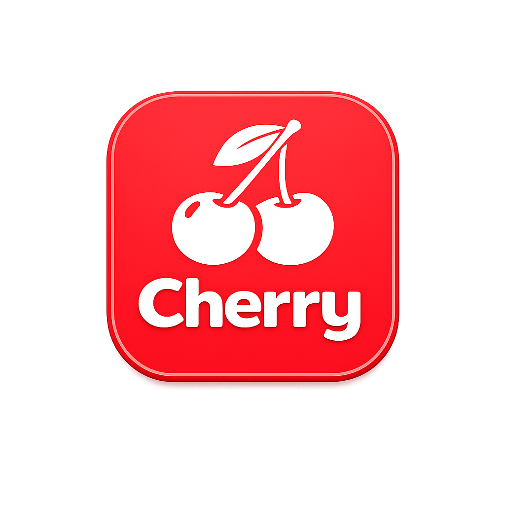

  

<h1 align="center">Cherry Browser</h1>

  A fast, lightweight web browser for macOS built with SwiftUI and WebKit.

---

## Features

### Browsing
- Full web browsing powered by WebKit/WKWebView
- Smart omnibox with URL detection and search engine integration
- Navigation controls (back, forward, reload, stop, home)
- Loading progress bar
- Find in Page
- Zoom controls

### Tabs
- **Chrome-style tab bar** — tabs dynamically resize to fill available space
- **Drag & drop reordering** — smooth tab reordering with visual feedback
- **Tab detaching** — drag a tab down to open it in a new window
- **Vertical tab bar** — optional sidebar-style tab list (Cmd+Option+V)
- **Tab groups** — organize tabs with colored groups, collapsible
- **Tab search** — quickly find and switch tabs (Cmd+Shift+A)
- **Tab sleeping** — inactive tabs auto-sleep after 30 minutes to save memory
- **Pin tabs** — keep important tabs compact and persistent
- **Recently closed tabs** — reopen closed tabs (Cmd+Shift+T)
- **Tab preview** — hover over a tab to see title and URL

### Bookmarks
- Add and manage bookmarks (Cmd+D)
- Bookmark bar for quick access
- Bookmark folders
- Bookmark sidebar (Cmd+Shift+B)

### History
- Full browsing history with search
- History sidebar (Cmd+Y)

### Homepage
- Custom homepage with shortcuts grid
- Built-in search bar
- Add, edit, and remove shortcuts

### Window Management
- Custom transparent titlebar with integrated traffic lights
- Full screen support
- Smooth window dragging from empty tab bar areas
- Multiple window support via tab detaching

## Keyboard Shortcuts

| Shortcut | Action |
|---|---|
| Cmd+T | New Tab |
| Cmd+W | Close Tab |
| Cmd+Shift+T | Reopen Closed Tab |
| Cmd+L | Focus Address Bar |
| Cmd+R | Reload |
| Cmd+[ | Back |
| Cmd+] | Forward |
| Cmd+D | Add Bookmark |
| Cmd+Y | Toggle History |
| Cmd+Shift+B | Toggle Bookmarks |
| Cmd+Option+B | Toggle Bookmark Bar |
| Cmd+Shift+A | Tab Search |
| Cmd+Option+V | Toggle Vertical Tabs |
| Ctrl+Tab | Next Tab |
| Ctrl+Shift+Tab | Previous Tab |
| Cmd+1-9 | Switch to Tab |

## Requirements

- macOS 14.0 (Sonoma) or later
- Xcode 15.0 or later

## Building

1. Clone the repository
2. Open `Internet Browser/Internet Browser.xcodeproj` in Xcode
3. Build and run (Cmd+R)

## Tech Stack

- **SwiftUI** — UI framework
- **WebKit (WKWebView)** — web rendering engine
- **Swift Observation** — reactive state management (@Observable)
- **AppKit integration** — NSViewRepresentable for window management and WebView

## License

All rights reserved.
